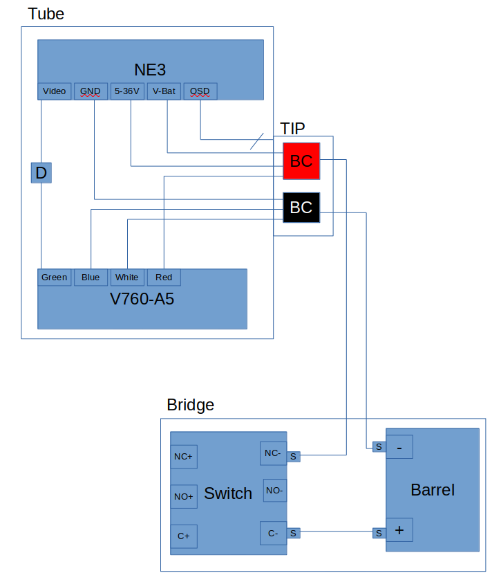

# MEME PVS-69

MEME Fork of [PVS 69](https://github.com/knack-tactical/PVS-69/tree/main). Goal here is to take the PVS 69 3D printed night vision dual tube optic as a base, extend it, clean up the documentation and make sure all the STL files used are in a singular place (and that all hardware required is clear).

# Base Optic (Externally Powered)

## Purchased Hardware

* [Run Cam Night Eagle 3](https://www.amazon.com/RunCam-Night-Camera-1000TVL-Support/dp/B09JVG2D5W/ref=sr_1_1?crid=3EEEQCPADZRAB&keywords=runcam+night+eagle&qid=1688258380&s=electronics&sprefix=runcam+night+eagle+%2Celectronics%2C288&sr=1-1&ufe=app_do%3Aamzn1.fos.006c50ae-5d4c-4777-9bc0-4513d670b6bc)
* V760-A5 display.
    * Available on ebay.
* 9x [M5x8 Bolts](https://amzn.to/3EyraZz) and [M5x5.8 Threaded Inserts](https://amzn.to/3E0fzRt)
    * 8 of these secure the brassless tip to the ambi tube + 1 optional one to secure the dovetail mount
* 4x [M2x10 Bolts](https://www.amazon.com/DYWISHKEY-Pieces-Stainless-Button-Screws/dp/B07W5HBRMP/ref=sr_1_4?keywo-rds=M2+x+10+bolts&qid=1688257184&sr=8-4)
    * These secure the runcam to the tube. These are an additional requirement added to the base PVS 69 and are not specified in the original design but are more or less required.
* 1x [3-Position Rotary Switch](https://amzn.to/3TspGUS)
* 1x [5.5x2.1mm DC Female Jack](https://amzn.to/3KLofNA)
* 4x [35mm Nitrile O-ring](https://amzn.to/3fVgjz8)
    * For the RunCam sensor cap and ambi tube display side opening. Size is approximate. Find a pack w/ sizes roughly 30mm-40mm outer diameter.
* 2x 22mm O-ring
    * For where the tip meets the ambi tube.
* Approximately 24" of [20-24 AWG wire](https://amzn.to/3EoQ5yn)

## Printed Hardware

* 2x [Ambi Tube](./STLs/Ambi%20tube.stl)
* 2x [Collar](./STLs/FOXTROT%20Collar_V760.stl)
* 2x [Sensor Cap](./STLs/RunCam%20sensor%20cap.stl)
* 1x [Bridge](./STLs/FOXTROT%20Gen4%20Bridge%20Body.stl)
* 1x [Bridge Plate](./STLs/FOXTROT%20Gen4%20Bridge%20Frontplate.stl)
* 1x [DoveTail](./STLs/Dovetail.stl)
* 4x [Washer](./STLs/FOXTROT%20Printable%20Washer.stl)

## Assembly

TODO

# Battery Pack

## Purchaded Hardware
* 4x 18650 Batteries
* 1x [Buck Converter](https://amzn.to/3KSzHHf)
* 1x 4x30mm bolt
* 1x 4x6x8 heatset insert

## Printed Hardware
* 1x [Body](./STLs/Battery_Box/18650_Body.3mf)
* 1x [Top](./STLs/Battery_Box/Top.3mf)
* 1x [Bottom](./STLs/Battery_Box/Bottom.3mf)
* 1x [Cap](./STLs/Battery_Box/Cap.stl)

## Assembly

## Wiring Diagram

* Assume both the runcam and the display pull 250mA @ 5v
* The display and runcam have appropiate guaged wires built in
* Each tube will have a single +/- lead going to the buck converter which must handle 500mA which should be atleast 22AWG
* The single pos lead from the Barrel Jack to the Switch must handle 1A which means these leads should be atleast 20AWG

* D  = dupont connector (heatshrinked to maintain connection but can be removed)
* BC = Butt Connected. Wires Stranded together w/ heatshrink over connection
* S = Soldiered.
* Note above diagram shows single tube. Since there are 2 tubes, the Barrel- and NC- have two leads from the two tubes soldeiered to the pin of the device.
* The OSD breakout connector for the runcam night eagle 3 just gets tucked in the TIP. Access to this connector is achieved by removing the tube from the TIP

# Adjustments

* Run cam focus
    * Focus one at a time
    * Spin lens left to loosen the lens and tighenting nut
    * Screw tighening nut all the way towards the lens
    * While looking through display, screw lens in until in focus
    * Use tightening nut to lock lens position
* V760 focus
    * Spin all the way to the left so that the lens is as far from the display as possible. This helps with the "double vision" issue.
    * Make sure displays are perfectly square in the tube and that all lens are clean.
* Buck converter voltage to 4.9 to 5.0V
    * Only needs to be done at 1 voltage, output will be stable regardless of input voltage as long as output exceeds input by 1V.
    * Spin adjuster screw right (tighten) to bring its outout as low as possible.
    * Power device with input of >8V
    * Attach multimemter to output
    * Slowly screw left (loosen) until output voltage is 4.9 to 5V
    * May need load on device when testing voltage. See the following from the data sheet:
        * At no load or light load, the converter may operate in pulse skipping mode in order to maintain the output voltage in regulation. Thus there is less time to refresh the BS voltage. In order to have enough gate voltage under such operating conditions, the difference of VIN - VOUT should be greater than 3V. For example, if the VOUT is set to 3.3V, the VIN needs to be higher than 3.3V+3V=6.3V to maintain enough BS voltage at no load or light load.
* Run cam settings
    * Unscrew the 4 bolts that connect the Tube to the TIP.
    * This should expose a black and blue cables with a JST connector.
    * Use tweezers to pull out of tube
    * Plug connector into JST board.
    * Kept stock settings but turned off all text banners
        * Under system select voltage NO, time NO, and set operator to an empty string.

# Future Work

* [ ] Power Survery. How much does run cam and display draw. Does it vary? If we end up using 4 18650's need a power survey of these batteries. Discharge characteristics, voltage vs charge %, etc.
* [ ] Run cam and V760-A5 survey.  Its unclear what advantage we get from the 70$ runcam night eagle 3 vs say a 30$ foxeer. What exactly is the benefit?? Likewise the displays used, v760-A5, are expensive and there is very little. V780s?
* [ ] Lens Study. FOV issue, would adding a different lens to the run cam be better?
* [ ] Want a bigger bridge
* [ ] runcam dump video to disk or wirelss
* [ ] lowlight and IR tests?
* [ ] longer bolts + washer on back of bridge
* [ ] Full assembly Procedure
* [ ] Dupont connector all internals. AWG specified. Lengths to cut wires. PLaces to add heat shrink to protect
* [ ] Make runcam OSD breakout connector more easily accesible