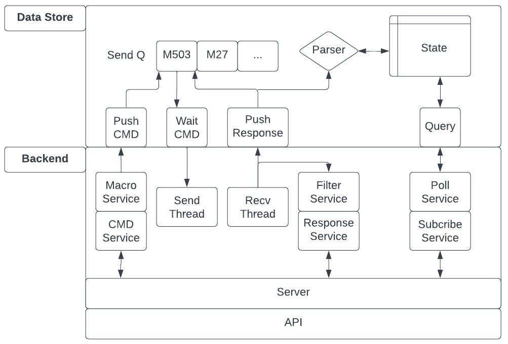

# MEME Controller

G code sender, printer montoring and control, and interface for executing testing/calibration sequences.

# Serial Communication

* Sending and recv-ing commands is done through the USB serial port (/dev/ttyACM0 for skr mini E3 V3.0)
* Commands are send in ascii delimited by a new line char
* The command protocal is [G-code](../marlin/Marlin_Docs/_gcode/)
* All commands, if properly recv-ed by the printer, are ACK-ed with a response "ok"
* Writing GCODE files to SD without Binary Transfer:
    * Initiate a GCODE file trasnfer with `M28 <filename>`
    * Commands are sent one by one, waiting for the `ok` ACK before sending the next
    * Reset the line number counter with `M110 N0`
    * Send the file line by line with the prefix `N<i>` where `i` is the line number
    * Postfix the command w/ the checksum of the entire command plus line number, deliminated by a `*` char.
        * The checksum is sent in decimal ASCII
    * For example,
        * `N1 G0 X10*C103`
        * `N2 G0 X20*C87`

# Dependancies
* Python 3.8.10
* textualize TUI 0.20
* socat for creating virtual serial ports to test code

# Running
* In one terminal navigate to the backend dir and execute `sudo python3 meme_backend.py`
* In another run navigate to the frontend folder and execute one of the following scripts:
    * `python3 monitor.py`: Front end monitor. Send Gcode, monitor temps, pos, etc. 
    * `python3 sd_file_send.py`: Pass a Gcode file and write it to the SD card on the printer

# High Level Overview

The "backend" implements the core functionality. Its responsibility is to send and recv GCODE commands (and possibly future custom commands to be implemented in our custom Marlin) over the USB serial interface. Its other responsibility is to expose a network socket that allows some frontend program to interface with the printer over this socket using the API detailed below. The justification for this separation is the following. We want a robust and resilliant backend to be primarly responsible for keeping a port to communicate the printer open. This backend will run on a general purpose processor and expose a networked port. This allows the creation of a suite of frontend scripts and tools that are fast and easy to implement as the backend will store macros, allow the query of printer state, and deal with serial communication nuances. 

These front end scripts could be a fancy java script web based monitoring tool for monitoring prints. Or could be a set of scripts to automate calibration and testing. The backend ensures all recved commands are queued until the printer, and in conjunction with the macro service it offers, allows these front scripts to be very simple and easy to create. The backend architecture is detailed below and as of writing this, only a simple command line interface for print monitoring is avaible, with more frontend scripts in the works.

# Backend Architecture

## Data store
The data store is a data structure that maintains 2 data elements and 4 main functions. Data elements:

1) `sendQ` The send Q holds a list of g code commands to be sent to the printer. The next command is sent only when the active command is ACKed by the printer. Each command is wrapped in Job class that holds timestamps for when its enqueued, sent, and ACKed. Finally, all responses from when the command is sent to when it is ACKed are stored with the command for logging purposes.
2) `StateMap` Tracks relavent state i.e. nozzle temp, target temps, current position, firware settings, etc. Holds a unique prefix and regex for parsing the responses that contain state information.

These data elements are accessed through the following functions:

1) `push_cmd(command)` Pushes a gcode command onto the sendQ to be sent when ready
2) `wait_cmd()` Blocks until the printer is ready for the next command. Returns string of command to be sent.
3) `push_reponse(line)` Register a response from the printer to the data store. Parsing of state happens here.
4) `query(key)` Returns current state value of the given key. Keys are short state decriptions like `nozzle temp current`. `get_all_state_keys()` returns list of acceptable keys.

## Backend
Implements all IO and networking functionality 
* **Send/Recv Thread.** Blocks on IO from printer via serial and registers IO with the data store
* **Response Publisher.** Thread to push all or filtered responses from printer over the client socket.
* **Server thread.** Thread to recv commands and macros over a socket and push them to the send Q. Handles all incoming packets, parses them, and takes apporpiate action.
* **Polling Thread.** Polls subscribed state and sends reports to client over network at 1s interval.

### Network API
The applciation protocol for communicating with the back end follows the following. All packets are at most 64 bytes and are terminated with a new line. All packets have a 4 byte ascii packet idetifying prefix, followed by an ascii space, followed by the payload.

| API Call | Sender | Example Packet Structure | Response | Comments | 
| --- | --- | --- | --- | --- |
| Send Command | Client | b'cmdG M503\n' | none | Client sends 'cmdG 'in ascii followed by gcode command (max 59 char) |
| Send Macro | Client | b'cmdM Home' | none | Client sends 'cmdM ' followe by a stored macro |
| Subscribe to Serial Reponses | Client | b'subR 1\n' | b'subR ...' | Client sends 'subR ' in ascii followed by 0,1,2 in ascii. V=0 -> Dont sent serial input. V=1 -> Send serial input but filter out polled responses (like auto temp report). V=2 -> Send all serial input. Server responds with subR prefix followed by responses from printer |
| Subscribe to State | Client | b'subS nozzle temp current\n' | b'subS key value' | Client sends 'subS ' followed by state key. Resend the same subS request to unsub. Server responds with subS prefix followed by key followed by value. Before sending a "flurry" of subS key value packets, server will send b'subS \n' to notify client to clear old values. |