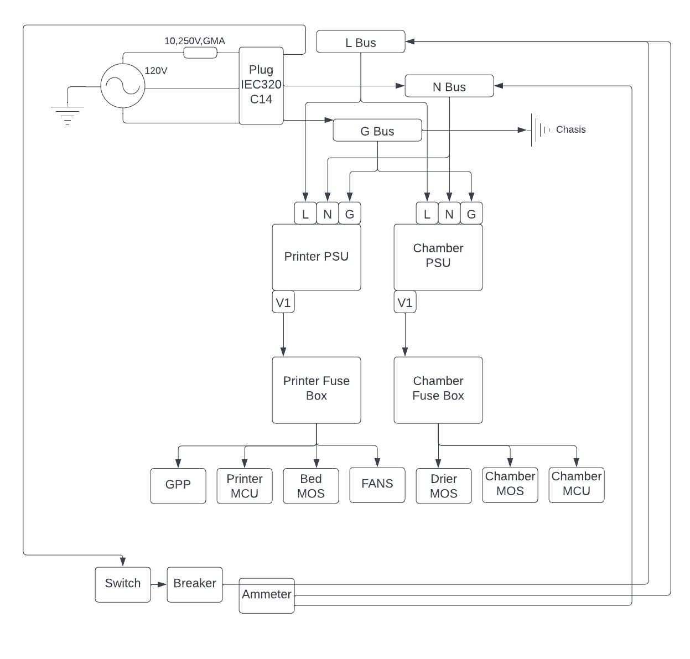

# Electronics Enclosure

# Requirements
* Allow enough space (or extensibility) to support electronics for chamber heater, filament dehydrator and other requirements listed on main page.
    * This would include space for 2 PSUs and up to 3 MOSFETs
    * Holds base printer MCU and possibly other MCUs to control other components.
    * Possibly support a screen.
    * Possibly support access to printer MCU SD card
    * Shall support access to printer MCU serial port
* All wiring and connectors shall be analyzed for power usage and proper guage wire / connector size shall be used.
* Provide neat cable managment from electronics enclosure to printer.
* Shall give easy access to electronics for prototyping.
* Shall allow additional components to be added later

# Wiring Diagrams and Connector Table

AC power is inputed from a 10A fused plug. The Live wire is connected to a switch, a breaker, and an ammeter measures current on this line. The live wire is then routed to a terminal bus to be distributed the power supplies. The neutral and ground wires are wired directly to their respective busses. The busses allow one to quicky add AC powered devices to the printer. Similarly, one line from the PSU is connected to a fuse box to distrubute 24V DC power. The PSU does not have a per line current limit, one line can draw the whole PSUs power.

## IEC320 Plug

* **Input** Stadard AC wall cable.
* **Output** Switch, N Bus, G, Bus
* **Rated Power** 125V AC, 10A, 1250W
* **Actual Load** 125V AC, ~8A, 1000W
* **Wire Gauge Required** 12AWG
* **Input Connecters** N/A
* **Output Connectors** Female Quick Disconnect

## Switch

* **Input** Plug
* **Output** Breaker
* **Rated Power** 125V AC, 30A, 3750W
* **Actaul Load** 125V AC, ~8A, 1000W
* **Wire Gauge Required** 12AWG
* **Input Connecters** Female Quick Disconnect
* **Output Connectors** Female Quick Disconnect

## 10A Breaker

* **Input** Switch
* **Output** Live Bus
* **Rated Power** 125V AC, 10A, 1250W
* **Actaul Load** 125V AC, ~8A, 1000W
* **Wire Gauge Required** 12AWG
* **Input Connecters** Female Quick Disconnect
* **Output Connectors** Female Quick Disconnect

## L, G, N Busses (5 port)

* **Input** Plug for Ground and Neutral, Breaker for Live
* **Output** PSUs, Ammeter, and ground also outputs to Chasis (This leaves a free port L/N)
* **Rated Power** 400V AC, 15A, 6000W
* **Actaul Load** 125V AC, ~8A, 1000W
* **Wire Gauge Required** 12AWG
* **Input Connecters** Spade Connectors
* **Output Connectors** Spade Connectors

## PSUs

* **Input** Busses
* **Output** Fuse Boxes
* **Rated Power** INPUT) 125V AC, ~4A, 500W per PSU. OUTPUT) 24V DC, ~20A, 500W per
* **Actaul Load** INPUT) 125V AC, ~4A, 500W per PSU. OUTPUT) 24V DC, ~20A, 500W per
* **Wire Gauge Required** 12AWG
* **Input Connecters** Spade Connectors
* **Output Connectors** Spade Connectors

## Fuse Boxes

* **Input** PSUs
* **Output** Terminal Devices
* **Rated Power** INPUT) 24 DC, 75A for entire box, 30A per curciut
* **Actaul Load** INPUT) 24V DC, ~20A, 500W (PSU limits current draw to ~20A)
* **Wire Gauge Required** 12AWG on input. Output wire gauge depends on terminal device power draw
* **Input Connecters** Ring Connectors
* **Output Connectors** Ring Connectors

# Bill of Materials

| Material | Quantity | Notes |
| --- | --- | --- |
| 2020 Aluminum T slot | 10 400mm | https://www.amazon.com/dp/B0B2P434PD?psc=1&ref=ppx_yo2ov_dt_b_product_details |
| Assorted M3 and M4 bolts, nuts and T slot nuts | Several | - |
| 40x40x10 fans | 4 | At 24V, .07A draw. https://www.amazon.com/dp/B088665SKK?psc=1&ref=ppx_yo2ov_dt_b_product_details | 
| Additional NTC Thermistors | 5 | https://www.amazon.com/dp/B0714MR5BC?psc=1&ref=ppx_yo2ov_dt_b_product_details |
| PTC heater (filament dehydrator) | 1 at 150W | https://www.amazon.com/dp/B07JKNKK7J?psc=1&ref=ppx_yo2ov_dt_b_product_details |
| PTC heater (chamber heater) | 1-2 at 150-250W | Maybe?? |
| Mosfets | 3 | https://www.amazon.com/dp/B07C4PGXFK?psc=1&ref=ppx_yo2ov_dt_b_product_details |
| Meanwell RSP-500-24 PSU | 2 | [Stock Meanwell RSP-500-24](../../DataSheets/MeanWell_500_Datasheet.pdf) |
| MCUs  | 2 | Currently SKR Mini E3 V3 |
| Switches | 1 | Standard 30A 120V AC switches |
| 10A 250V GMA Fuse | 1 | Integrated in AC plug |
| Various disconnect connectors | >20 | Various sizes, 10AWG to 22AWG, amp rating appropiate to wire gauge. Use appropiate sized connectore given wire gauge |
| Spade Connectors | >20 | 16AWG to 12AWG, 8 to 10 Stud size | 
| AC Plug | 1 | iec320 C14 |
| Wire 16AWG, 12AWG | A few meters of each | - |
| Ampmeters | 1 | https://www.amazon.com/dp/B01M8LCWNW?psc=1&ref=ppx_yo2ov_dt_b_product_details |
| Fuse Box | 2 | https://www.amazon.com/dp/B0838TZ2Z2?psc=1&ref=ppx_yo2ov_dt_b_product_details |
| Terminal Busses | 3 | https://www.amazon.com/dp/B07CLY91HZ?psc=1&ref=ppx_yo2ov_dt_b_product_details |
| 10 Amp Thermal Breaker | 1 | Standard | 
