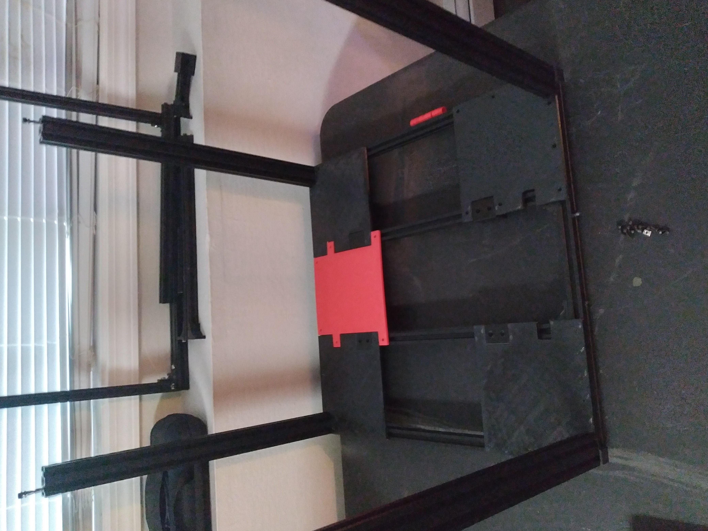

# Ricks Enclosure

Rick's Enclosure for the Prusa i3 MK3s+. This enclosure contains a quantum tessellated vacuum and is the finest enclosure in the cental finite curve. This project started off as a simple enclosure for a prusa mk3s+, but has evolved into more of a mod project of this printer. This project is successor of [Rick's CEP5](https://github.com/tanner-johnson2718/Ricks_Enclosure). In this project we recycle the components from our ender 5+. We use the frame as the frame of the enclosure and we reuse the BTT skr mini e3 v3 to provide additional sensors and additional compute to manage the environment inside the enclosure. The ultimate goal is an enclosure that can maintain suitable temperatures for PA and ABS/ASA.

# The Physical Frame

As stated before we will be using the frame from the ender 5 plus. Before commiting let us see if the frame is actually big enough. Its outer dimensions are:

* X = 538mm
* Y = 557mm
* Z = 557mm

The frame is built from aluminum 2020 extrusion with 4020 verticals. The effective space we get in the X dimension is 458mm as two vertical slats of the frame eat up 80mm of that usable space. The prusa requires 420mm in the X dir and thus this should be sufficient. In the Y direction, we should be able to use most of the 557mm span by placing the walls of the enclosure on the outer frame. Note the prusa is a bed slinger and requires a ridiculous 550mm to operate without hitting the walls. **Note** we may need to modify how the bed cables are routed in the rear of the bed. Finally in the Z-direction we will loose 20 to 40 mm of space because of the 2020 framing, but given that (without a spool holder) we only require 380mm of clearance, we will be fine. Thus this back of the envelope calculation shows we should be able to fit our prusa into an ender 5+ no problem.

## The Base

The bottom or base on which the prusa will sit will be made from 3D printed panels (we will use PETg as it should have sufficient heat resistance). Metal is too expensive and wood to flammable. The prusa can only print about 200mm by 200mm panels thus 1) we need to come up with a 3x3 tile scheme and 2) we should probably add some additional supports made of 2020 aluminum extrusion to help support the 3D printed tiles. We can reuse the design from our [CE5P](https://github.com/tanner-johnson2718/Ricks_Enclosure/Printer_Mods/Electronic_Enclosure) where we mounted electronics on the base of the printer frame. The resultant design is contained in this Free CAD [file](./enclosure.FCStd) and looks like the following:

CAD Rendering of Bottom Frame |
:-------------:|


The center running pieces of aluminum have those bulky 3D printed pieces we are calling "couplers". These exist simply because we did not have any 2020 that was long enough to run the whole 500+ mm of the frame. The only additional materials (besides a spare ender 5+) used in this portion of the build are:

* (x4) [Couplers](./STLs/Plates/Coupler.stl)
* (x4) 90 degree 2020 corner supports I found in my junk drawer (easy enough to whip up, you dont need a link to an STL).
* (x2) 400mm 2020
* (x2) 113mm 2020

Now we design the following panel scheme on top of this frame:

CAD Rendering of Bottom Frame with Panels
:------------:|


The 3x3 tile scheme was designed so that each piece is supported by the center running aluminum frame (hence the weird tabs that stick out into the other pieces). There are cutouts on the corner pieces to accommodate the vertical 4020 supports of the frame and to accommodate the couplers (these cutouts made it so 2 of the corners are the chiral opposite or mirrored opposite of the other 2). These tiles are secured to the frame via M3x8 bolts and M3 v-slot nuts. The M3 bolts are counter sunk across the tiles to create a smooth-ish surface. You will notice there are also additional 3mm holes across the outer perimeter of the frame to allow us to secure components to the base of the enclosure since we are covering up the v-slot. The BOM for this portion is as follows:

* (x2) [Corner Piece](./STLs/Plates/Corner.stl)
* (x2) [Corner Piece (mirrored)](./STLs/Plates/Corner_Chiral.stl)
* (x2) [Left / Right Pieces](./STLs/Plates/LR.stl)
* (x2) [Up / Down Pieces](./STLs/Plates/UD.stl)
* (x1) [Center Piece](./STLs/Plates/center.stl)
* (x58) M3x8mm and M3 v slot nut

At this point our enclosure is starting to come together:

Bottom Panels Being Assembled |  Bottom Done Plus Sexy Shop Shot
:-------------------------:|:-------------------------:
  |  

## The Top

A good portion of this project has been stealing designs from the ender 5+ build. Its fitting that the top design is literally stolen from the bottom. The only change we need to make is the corner pieces do not need a cutout for the verticals:

Top Corner Panels CAD Rendering | 
:-------------------------:|
 |

The top portion of the frame must also be supported with additional 2020 and the couplers as in the bottom. This produces the following BOM and the install steps are exactly the same as the bottom.

* (x4) [Couplers](./STLs/Plates/Coupler.stl)
* (x4) 90 degree 2020 corner supports I found in my junk drawer (easy enough to whip up, you dont need a link to an STL).
* (x2) 400mm 2020
* (x2) 113mm 2020
* (x2) [Corner Piece](./STLs/Plates/Corner_Top.stl)
* (x2) [Corner Piece (mirrored)](./STLs/Plates/Corner_Top.stl)
* (x2) [Left / Right Pieces](./STLs/Plates/LR.stl)
* (x2) [Up / Down Pieces](./STLs/Plates/UD.stl)
* (x1) [Center Piece](./STLs/Plates/center.stl)
* (x58) M3x8mm and M3 v slot nut

## The 3 Sides

Now for the sexy part, the acrylic sides. This is the portion of the build where the project and its overall aesthetic starts to manifest. We choose to build the side and back panels as just a contiguous piece of acrylic sheet. This is 1 for cost, 2 for simplicity, and 3 for visibility into the enclosure. The basic idea is to 3D print a trim or bezel that runs the outer perimeter of each side. It contains a U-channel that friction fits the acrylic panels. With the top off, we cut and slide each acrylic sheet in and then simply screw the top back on to secure the top portion of the u channel supporting the sheet. These U-Channel trim pieces we are calling slides and they look something like:

CAD Rendering of Slides in a Single Corner
:------------:|


From the above rendering one should get the idea. These slides cover the entire perimeter of the two side walls and the back wall of the enclosure. On the bottom portion the slides are aligned to the bottom panels and match the 3mm mounting holes we left in the panels. The top portion of the slides are the exact same as the bottom only they are secured via the v slot frame of the top. On the vertical portions, the slides are also mounted via v-slot. We arbitrarily broke the vertical slides into 3 portions for printability. The top and bottom vertical corner slides are 200mm in length and the middles length is chosen to to fill in the rest of the distance. The BOM for this portion of the build is as follows:

(x2) Each Side Wall:
* (x4) [Corner Top and Bottom (Side)](./STLs/Slides/Corner_Side_slide.stl)
* (x2) [Middle Top and Bottom (Matches LR Panel)](./STLs/Slides/LR_slide.stl)
* (x4) [Vertical Corner](./STLs/Slides/vert_corner.stl)
* (x2) [Vertical Center 85mm](./STLs/Slides/vert_center_85.stl)
* (x1) 502mm x 475mm x 2.2mm Acrylic Sheet
* (x24) M3x8mm Bolts
* (x18) M3 v slot nuts

(x1) Back Wall:
* (x4) [Corner Top and Bottom (Front)](./STLs/Slides/Corner_Front_slide.stl)
* (x2) [Middle Top and Bottom (Matches UD Panel)](./STLs/Slides/UD_slide.stl)
* (x4) [Vertical Corner](./STLs/Slides/vert_corner.stl)
* (x2) [Vertical Center 105mm](./STLs/Slides/vert_center_105.stl)
* (x1) 445mm x 494mm x 2.2mm Acrylic Sheet
* (x24) M3x8mm Bolts
* (x18) M3 v slot nuts

## The Door

The door as in the sides will be made of acrylic sheet. However It will be a double door made of two separate sheets and will not be supported by slides as in the 3 other walls. The two door acrylic pieces will be secured to the frame via hinges and will sit flush to the outer face of the frame (the other 3 walls are inset in the frame). We design some basic hinges that have worked thus far and use M3 x 50 bolts as hinge pins. The CAD file for these is [this file](./STLs/Door/hinge.FCStd) and we show the cad rendering below:

Hinge CAD Rendering
:------------:|


One thing to note about the above design is how the two pieces of the hinge do not lie flat i.e. are not co-planer.  This is because we want the thicker piece to sit flush with the frame while the skinnier piece sits flush with the piece of acrylic door. We also designed a quick drilling jig to place the holes in the acrylic at just the right spot so that 1) the acrylic is flush with the outer perimeter and 2) is exactly aligned with the v slots in the 4020 aluminum. Finally we have a design for, an albeit half ass, latch. The rear piece is to catch the top piece of the aluminum frame the front piece keeps one side of the door secured to the other. This is a very quick and dirty design but has worked so we have not fucked with it:

The Completed Frame and Door
:-----------:|


# Secondary Considerations

## Filament Spool Storage and Filament Path Considerations

We initially used the filament box from the [CE5P](https://github.com/tanner-johnson2718/Ricks_CE5P/tree/master/Printer_Mods/Dehydrator) which had several flaws. The PVC rod that the spools rotated about had lots of friction, was a hassle to change filament, and the spool fed from the bottom making it even harder to change filament and created a short radius curve in the bowden tube (again increasing friction). We just threw a bunch desiccant at the bottom with no real plan of how to swap it out. And Finally the box was far to big and did not fit on the enclosure nicely and created another short radius curve in order to pass the filament through the hole in the top. Thus we want the following features in our new box:

* Smaller water proof tote so that filament can feed directly above the X-Gantry of the mk3s
* Top loading of filament on rollers.
* Filament feeds from top side of roll not bottom
* Swap-able desiccant cartridges.
* Re-use as many parts from the CE5P as possible

Final Design Outcome
:-----------:|


We "stole" the filament roller design from [this guy](https://www.thingiverse.com/thing:2250077). We didn't use any of his source file but redesigned the same concept from scratch in this [CAD file](./STLs/Spool%20Box/Spool%20Roller.FCStd), with some improvements and made the rollers work with the 625zz bearings off the ender 5 plus v-slot rollers. 

Next we made some interface pieces for the 10mm bowden tube couplers. Note that these couplers were placed towards the top of the spool to enlarge the required curvature radius and to make loading new filament easier. The bowden tube interface couplers ease the tension on the plastic tote and we added a tube stowage interface piece for when a slot is not in use.

Instead of haphazardly throwing desiccant on the floor of the tote we used these [desiccant containers](https://www.printables.com/model/22337-desiccant-box/files) and designed some holders for them [here](./STLs/Spool%20Box/Spool%20Roller.FCStd). They have been doing a fine job lowering the humidity despite the lowered surface area of desiccant contact.

Finally, for good measure, we threw in a [filament filter](https://www.thingiverse.com/thing:492067). We cut up a scotch sponge and placed in this filter to reduce any contaminates from entering the hot end.

### BOM

| Item | Qty | Comment | 
| --- | --- | --- |
| [Tote](https://www.walmart.com/ip/Sterilite-20-Qt-Clear-Gasket-Storage-Box-Blue-Latches-with-Clear-Lid/39916455?fulfillmentIntent=In-store) | 1 | - |
| [Filament Filter](https://www.thingiverse.com/thing:492067) | 2 | - |
| [Roller](./STLs/Spool%20Box/roller_82mm.stl) | 4 | The 82mm version is sized perfectly to a 1KG polymaker spool |
| [Washers](./STLs/Spool%20Box/washer.stl) | 8 | Can use 5mm ID washers but we just printed some |
| [Legs](./STLs/Spool%20Box/side.stl) | 4 | - |
| [10mm Bowden Coupler Plate](./STLs/Spool%20Box/coupler_plate.stl) | 2 | Helps keep the tote from being damaged by screwing the large 10mm coupler |
| [Tube Plate](./STLs/Spool%20Box/tube_plate.stl) | 2 | Just a nice place to park your Bowden tube |
| 10mm Bowden Couplers w/ clip | 2 | - |
| ~400 section of Bowden Tube (PTFE 2mm ID and 4mm OD) | 2 | - |
| [Desiccant Box Body](./STLs/Spool%20Box/desiccant_box_body.stl) | 4 | [Stole](https://www.printables.com/model/22337-desiccant-box/files) |
| [Desiccant Box Lid](./STLs/Spool%20Box/desiccant_box_lid.stl) | 4 | [Stole](https://www.printables.com/model/22337-desiccant-box/files) |
| [Desiccant Box Holder](./STLs/Spool%20Box/dbox_holder.stl) | 4 | - |
| Random temp and humidity sensor | 1 | - |
| M3 x 8mm Nuts and Bolts | 41 | - |

### References, Inspiration, and Open Source Designs used
* [Spool Roller 1](https://www.printables.com/model/17-original-prusa-i3-mk3-enclosure-ikea-lack-table-pr/files)
* [Spool Roller 1 (625 bearings)](https://www.printables.com/model/287806-adjustable-spool-holder-update-625zz-bearings-qty-/files)
* [Spool Roller 2](https://www.thingiverse.com/thing:2250077)
* [Filament Filter](https://www.thingiverse.com/thing:492067)
* [Desiccant Box](https://www.printables.com/model/22337-desiccant-box/files)


## Electronics

The electronics, to include the PSU and main control board, will be moved to the outside of the printer. To achieve this we first cut all the end connectors that plug into the board roughly 50mm from the connecter. We then extend the 50mm wire with the EINSY board side connector to a length of 400mm. Finally we insert quick connect / disconnect **JST-SM 2.5mm** connectors so that where the wires were cut can be connected and disconnected easily. This process extends the wires and gives us a quick way to disconnect the wires if we wish to take the printer out of the enclosure.

Now we drill a 30mm whole on the left side of the enclosure but centered. This gives us a hole to route the wires outside the enclosure. Next we add an additional MCU (a BTT SKR mini e3 v3), two terminal busses to distribute the 24v power from the PSU (the EINSY needs two leads and the SKR needs one, but the PSU only has two outputs), and we run two thermistors back into the enclosure. One placed roughly 100mm off the ground taped to the left wall. The other zip-tied to the collection of wires ran to the hotend roughly 100mm behind the nozzle. This gives us a near nozzle / bed and ambient chamber temp reading.

Finally we print the following brackets to mount the psu and MCUs to the frame:

* https://www.printables.com/model/42409-prusa-mk3s-psu-wall-mount/files
* [MCU Bracket](./STLs/Elec_Mounts/Elec_Mounts-Bracket.stl)

Electronics Mounted |  Hole Placement
:-------------------------:|:-------------------------:
  |  

## Klipper

We will use Klipper as the firmware that runs the printer. We do this because 1) we need an additional control board to run the additional thermistors and 2) we want to use a laptop and mainsail as the main printer interface. We use the laptop as described and set up in our [CE5P Klipper Instance](https://github.com/tanner-johnson2718/Ricks_CE5P/tree/master/Klipper). Moreover, we can use all the same tuning and calibration steps as we did with our [CE5P Tune](https://github.com/tanner-johnson2718/Ricks_CE5P/tree/master/Calibration_Test_Prints). Below is some additional notes on how tweaked the existing CE5P Klipper set up for the prusa.

* https://github.com/dz0ny/klipper-prusa-mk3s @ 63b8edf as starting config.
    * In klipper-prusa-mk3s/einsy-rambo.cfg change virtual SD card to match name of printer and path you used when setting up klipper. Since we are using the CE5P laptop, the printer name is CE5P.
* Add:

```
[mcu skr]
serial: /dev/serial/by-id/usb-Klipper_stm32g0b1xx_46002A000B504B5735313920-if00

[temperature_sensor test_sensor1]
sensor_type: EPCOS 100K B57560G104F
sensor_pin: skr:PC4

[temperature_sensor Ambient_Chamber_Temp]
sensor_type: EPCOS 100K B57560G104F
sensor_pin: skr:PA0
```

* Square-up gantry by basically ramming 
* Z-off reset starting at 1.500 and using spark plug gaper to measure actual distance from nozzle to bed.
* Print a 200mm by 200mm square, one layer thick to test first layer.
* Printed a random decorative piece with lots of retractions and complicated geometry to verify settings.
* Found that default firmware settings worked well with default prusa slicer profiles.
    * At least for PETg and ASA.
* ASA showed no warping or layer adhesion issues and so can conclude the enclosure did its job.

# Possible Future Stuff

* LEDs?
* Camera?
* Filtration?
* Insulated Top?
* Printing Profiles that mesh with klipper i.e. save off printing profiles
* Better Handle and Latch
* Can Bus / PI Upgrade
* Rewire
* LEDs
* Full Klipper Tune IAW CE5P tune (this will include a print profile tune)
* X/Y Belt Issues